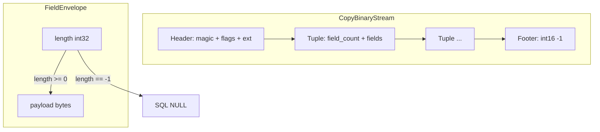
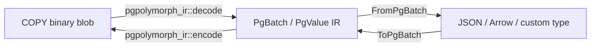

# pgpolymorph-ir Crate Specification

## Goal

Bootstrap a Rust workspace in [`/Users/adam/pgpolymorph`](/Users/adam/pgpolymorph) with one crate, **`pgpolymorph-ir`**, that is a **bidirectional converter** between:

- **Input A:** a valid PostgreSQL `FORMAT binary` blob in memory + an external `Schema` → **Output:** typed IR (`PgBatch`)
- **Input B:** typed IR (`PgBatch`) + an external `Schema` → **Output:** a valid `FORMAT binary` blob (`Vec<u8>`)

The blob is exactly what you get from reading a file dumped by PostgreSQL in binary format (e.g. `\copy t TO 'out.bin' WITH (FORMAT binary)`). The caller is responsible for obtaining that blob — this crate does **not** talk to PostgreSQL, libpq, or the network.

This crate owns:

1. **Value IR** — canonical in-memory representation of PostgreSQL row data
2. **Schema types** — external `Schema` required for typed decode/encode
3. **COPY binary format** — parse/serialize the file-format blob (header, tuples, footer, field envelopes)
4. **Conversion traits** — `FromPgBatch` / `ToPgBatch` trait **definitions** (serde-style: traits here, implementations elsewhere)
5. **Public API** — `decode` / `encode` between bytes and IR

Format-specific **implementations** of the traits (JSON, Arrow, etc.) live in separate crates (e.g. `pgpolymorph-json`) that depend on `pgpolymorph-ir` and their own format libraries. Trait definitions add **zero dependencies** — only impl crates pull in serde, arrow, etc.

Reference for PostgreSQL binary type encodings: PostgreSQL documentation and `src/backend/utils/adt/` send/receive functions.

### Scope boundary: COPY binary file format vs pgwire

| In scope | Out of scope (other crates) |
|----------|----------------------------|
| COPY binary file blob (magic + tuples + footer) | pgwire protocol (StartupMessage, Query, CopyIn/CopyOut framing, CopyData messages) |
| Field envelope parsing (`int32` length + payload) | Extracting binary payload from a live connection |
| Typed decode/encode given external `Schema` | Schema discovery from catalog or RowDescription messages |
| Bytes in → IR out; IR in → bytes out | libpq, tokio-postgres, async connection handling |

---

## Workspace Layout

```
pgpolymorph/
├── Cargo.toml                 # [workspace] members = ["pgpolymorph-ir"]
└── pgpolymorph-ir/
    ├── Cargo.toml             # thiserror; optional serde feature
    ├── README.md              # COPY binary format + IR overview
    └── src/
        ├── lib.rs             # crate docs + re-exports + top-level API signatures
        ├── error.rs           # Error / Result types
        ├── schema.rs          # PgType, Column, Schema
        ├── value/             # PgValue, PgRow, PgBatch + pgtypes/
        ├── traits.rs          # FromPgBatch, ToPgBatch (trait defs only — no impls)
        ├── binary/            # COPY binary FILE format (NOT pgwire)
        │   ├── mod.rs
        │   ├── buffer_view.rs # all binary parsing (cursor + typed reads)
        │   ├── constants.rs   # magic bytes, payload sizes, COPY envelope constants
        │   ├── field.rs       # FieldCell, FieldReader (COPY field envelope)
        │   ├── header.rs      # PgBinaryHeader parse/write
        │   ├── reader.rs      # PgBinaryReader (incremental blob parse)
        │   └── writer.rs      # PgBinaryWriter (incremental blob write)
        └── codec/
            ├── mod.rs
            ├── decode.rs      # FieldDecoder: payload bytes → PgValue (per PgType)
            ├── encode.rs      # FieldEncoder: PgValue → payload bytes (per PgType)
            └── array.rs       # array header + element iteration
```

All modules contain **type definitions, doc comments, and function/trait signatures only** — bodies are `todo!()` or omitted with `// TODO: implement`.

---

## Dependency Policy

| Crate | Dependencies |
|-------|-------------|
| `pgpolymorph-ir` (default) | **`thiserror` only** (std otherwise) |
| `pgpolymorph-ir` + `serde` feature | `thiserror`, optional **`serde`** with `derive` |

Rationale: keep transitive deps minimal by default. Use `std::io::Cursor` for byte slicing, manual big-endian reads/writes, and `thiserror` for the `Error` enum. Avoid `bytes`, `arrow`, etc.

Enable **`pgpolymorph-ir/serde`** when you need `Serialize`/`Deserialize` on public IR types (`PgValue`, `PgBatch`, `PgJson`, etc.). JSON/`jsonb` remain raw `String` fields in IR; parse to typed structs with `serde_json::from_str` in format crates or application code. Format-specific conversion still uses `FromPgBatch`/`ToPgBatch` in separate crates.

Future format crates depend only on `pgpolymorph-ir` (for IR types + traits) plus their format-specific deps (e.g. `serde_json`). They **implement** `FromPgBatch` / `ToPgBatch`; they do not redefine the traits.

---

## PostgreSQL COPY Binary File Format

This is the on-disk / in-memory blob format written by `COPY ... WITH (FORMAT binary)`, **not** the pgwire CopyData message stream. All multi-byte integers are **big-endian**. The blob is self-validating: magic header + `-1` footer sentinel.



### Header (19 bytes minimum)

| Offset | Size | Field |
|--------|------|-------|
| 0 | 11 | Magic: `PGCOPY\n\xFF\r\n\x00` |
| 11 | 4 | Flags (`int32`, typically 0) |
| 15 | 4 | Extension length (`int32`, typically 0) |
| 19 | N | Extension payload (if length > 0) |

### Per-tuple

| Field | Type |
|-------|------|
| `field_count` | `int16` — must match `Schema::columns.len()` |
| × `field_count` | Field envelope (below) |

### Field envelope (every column value)


```
NULL:     FF FF FF FF           (int32 -1, no payload)
NON-NULL: [len: int32 BE][payload: len bytes]
```

### Footer

| Field | PgValue |
|-------|-------|
| sentinel | `int16` `-1` (`0xFFFF`) |

---

## Supported Types (v1 spec)

PostgreSQL binary send/receive encodings. Schema must declare the type; the binary blob does not carry scalar OIDs.
| PgType | OID | Fixed payload | Encoding notes |
|--------|-----|---------------|----------------|
| Bool | 16 | 1 | `u8` 0/1 |
| Bytea | 17 | variable | raw bytes |
| Char | 18 | 2 | `int16` |
| Int2 | 21 | 2 | `int16` BE |
| Int4 | 23 | 4 | `int32` BE |
| Int8 | 20 | 8 | `int64` BE |
| Text | 25 | variable | UTF-8, no NUL |
| Varchar | 1043 | variable | UTF-8, no NUL; max length from schema typmod (`PgType::Varchar(Some(n))`) |
| Json | 114 | variable | raw UTF-8 JSON text |
| Jsonb | 3802 | variable | `[u8 version=1][json utf8]` |
| Float4 | 700 | 4 | IEEE754 BE |
| Float8 | 701 | 8 | IEEE754 BE |
| Date | 1082 | 4 | days since **2000-01-01** |
| Time | 1083 | 8 | microseconds since midnight |
| Timestamp | 1114 | 8 | microseconds since **2000-01-01** |
| Interval | 1186 | 16 | `[i64 micros][i32 days][i32 months]` |
| Array(inner) | — | variable | see below |

This crate targets the PostgreSQL binary types listed below, plus additional types in [Additional types](#additional-types).

**Array payload** (inside field envelope; PostgreSQL array binary format):

```
[int32 total_len]           # size of everything after this field
[int32 ndim]                # number of dimensions (1 or more)
[int32 has_nulls]           # 1 if any element is NULL
[int32 element_oid]
# repeated ndim times:
[int32 dim_length]
[int32 dim_lower_bound]     # typically 1
[element₀][element₁]...     # flat row-major order; each element uses standard field envelope
```

v1 spec: **multi-dimensional arrays** (`ndim >= 1`). Composite/record types remain out of scope.

### Additional types

Wire layout per PostgreSQL binary send/receive:

| PgType | OID | Payload | Notes |
|--------|-----|---------|-------|
| Timestamptz | 1184 | 8 | same wire layout as `Timestamp`; tz interpretation is metadata |
| Timetz | 1266 | 12 | `[i64 micros since midnight][i32 tz offset in seconds]` |
| Numeric | 1700 | variable | PostgreSQL numeric binary format (sign + weight + digits) |
| Uuid | 2950 | 16 | raw 128-bit UUID bytes |
| Money | 790 | 8 | `int64` scaled cents |
| Oid | 26 | 4 | `uint32` OID value |
| Name | 19 | variable | counted string (like `Text`) |

Additional types may be added incrementally; unknown OIDs remain a decode error until supported.

### IR temporal representation

Binary codec converts PostgreSQL wire epochs at the boundary. **IR stores Unix-standard units** so downstream format crates (JSON, Arrow, etc.) avoid re-converting:

| IR field | Representation |
|----------|----------------|
| `Date` | `i32` — days since Unix epoch (1970-01-01) |
| `Timestamp` | `i64` — microseconds since Unix epoch (UTC) |
| `Timestamptz` | `i64` — microseconds since Unix epoch (UTC) |
| `Time` | `i64` — microseconds since midnight (no date component; not epoch-based) |
| `Timetz` | `{ micros: i64, tz_offset_secs: i32 }` |

Wire ↔ IR conversion applies the standard PostgreSQL epoch offsets (e.g. PG date base 2000-01-01 ↔ Unix date base 1970-01-01) inside `codec/decode.rs` and `codec/encode.rs`.

---

## IR Design

### Schema layer — [`schema.rs`](src/schema.rs)

External schema is **required** for typed decode/encode.

```rust
pub enum PgType {
    Bool, Bytea, Char, Int2, Int4, Int8,
    Float4, Float8,
    Text, Varchar(Option<u32>), Json, Jsonb,
    Date, Time, Timestamp, Timestamptz, Timetz,
    Interval, Numeric, Uuid, Money, Oid, Name,
    Array(Box<PgType>),
}

pub struct Column {
    pub name: String,
    pub ty: PgType,
    pub nullable: bool,
}

pub struct Schema {
    pub columns: Vec<Column>,
}
```

`PgType::oid()` and `PgType::from_oid(u32)` live in [`schema.rs`](src/schema.rs). Unknown OIDs are a decode error in v1 (no `Unknown` variant yet — keeps spec tight; add later if needed).

### Value layer — [`value/mod.rs`](src/value/mod.rs)

Typed IR uses **Unix-standard temporal units** at rest (see [IR temporal representation](#ir-temporal-representation)). Binary codec performs PG wire ↔ IR conversion. Each PostgreSQL type maps to a dedicated struct under [`value/pgtypes/`](src/value/pgtypes/).

```rust
pub enum PgValue {
    Null,
    Bool(PgBool),
    Bytea(PgBytea),
    Char(PgChar),
    Int2(PgInt2), Int4(PgInt4), Int8(PgInt8),
    Float4(PgFloat4), Float8(PgFloat8),
    Text(PgText), Name(PgName),
    Json(PgJson),           // raw JSON text (not pre-parsed)
    Jsonb(PgJsonb),         // version byte + raw JSON text
    Date(PgDate), Time(PgTime),
    Timestamp(PgTimestamp), Timestamptz(PgTimestamptz), Timetz(PgTimetz),
    Interval(PgInterval),
    Numeric(PgNumeric),
    Uuid(PgUuid),
    Money(PgMoney), Oid(PgOid),
    Array(PgArray),
}

pub struct ArrayDimension {
    pub length: i32,
    pub lower_bound: i32,   // from PG array header (often 1, not always)
}

pub struct PgArray {
    pub element_type: PgType,
    pub dimensions: Vec<ArrayDimension>,
    pub elements: Vec<PgValue>,   // flat row-major
}

pub struct PgRow {
    pub values: Vec<PgValue>,  // len == schema.columns.len()
}

pub struct PgBatch {
    pub rows: Vec<PgRow>,
}
```

Design notes:

- `PgValue` is the **only** format-agnostic data model; downstream crates map `PgValue` ↔ JSON/Arrow/etc.
- `PgJson`/`PgJsonb` store raw UTF-8 strings (no `serde_json` dependency); parse in format crates via `serde_json::from_str`.
- Optional **`serde` feature** adds `Serialize`/`Deserialize` derives on public IR types; default build has no serde dependency.

---

## Conversion Traits — [`traits.rs`](src/traits.rs)

Following the **serde model**: trait definitions live in the core crate; format crates provide implementations. This lets users implement custom formats by depending on a single crate (`pgpolymorph-ir`).

### Batch-level traits (v1)

```rust
/// Convert from IR to a native format representation.
pub trait FromPgBatch {
    type Output;
    type Error;
    fn from_pg_batch(schema: &Schema, batch: &PgBatch) -> Result<Self::Output, Self::Error>;
}

/// Convert from a native format representation to IR.
pub trait ToPgBatch {
    type Error;
    fn to_pg_batch(&self, schema: &Schema) -> Result<PgBatch, Self::Error>;
}
```

Design notes:

- `Schema` is passed explicitly so impls can validate types and column layout.
- Each format crate defines its own `Error` type (e.g. `pgpolymorph_json::Error`); no coupling to `pgpolymorph_ir::Error`.

### Example usage (future `pgpolymorph-json`)

```rust
// In pgpolymorph-json (separate crate):
impl FromPgBatch for serde_json::Value { /* ... */ }
impl ToPgBatch for serde_json::Value { /* ... */ }

// User's custom format crate:
impl FromPgBatch for MyOutput { /* ... */ }
impl ToPgBatch for MyInput { /* ... */ }
```

### Full pipeline (across crates)



No trait implementations for JSON, Arrow, or any external format appear in `pgpolymorph-ir`.

---

## Module Responsibilities

### `binary/` — COPY binary blob framing (no type knowledge, no pgwire)

Handles the file-format container only. Assumes the caller passes a complete blob (or a slice thereof) already extracted from disk or from a higher-level pgwire crate.

| Type | Role |
|------|------|
| `PgBinaryHeader` | Parsed header (flags, extension bytes) |
| `FieldCell<'a>` | `{ is_null: bool, payload: BufferView<'a> }` — zero-copy view into input |
| `PgBinaryReader<'a>` | Iterator over tuples; yields `Vec<FieldCell<'a>>` per row |
| `PgBinaryWriter` | Writes header, tuples (from raw cells or via typed path), footer |

Binary framing layer validates: magic, footer sentinel, field_count consistency, payload lengths within bounds, no truncated reads.

### `codec/` — typed payload codec

`FieldDecoder` and `FieldEncoder` carry `column`, `ty`, and `nullable` so all decode/encode errors include real column names and expected types.

```rust
// decode.rs
pub(crate) struct FieldDecoder<'a> { column: &'a str, ty: &'a PgType, nullable: bool }
impl FieldDecoder<'_> {
    pub(crate) fn decode(&self, cell: &FieldCell<'_>) -> Result<PgValue, Error>;
    fn ensure_min_remaining(&self, view: &BufferView<'_>, min: usize, reason: &'static str) -> Result<()>;
}

// encode.rs
pub(crate) struct FieldEncoder<'a> { column: &'a str, ty: &'a PgType, nullable: bool }
impl FieldEncoder<'_> {
    pub(crate) fn encode(&self, value: &PgValue) -> Result<EncodedField, Error>;
}
```

`EncodedField` is a small owned buffer `{ length: i32, payload: Vec<u8> }` or an enum distinguishing Null vs NonNull.

Array logic in [`codec/array.rs`](src/codec/array.rs): parse/write array header (`ndim` dimension pairs + element OID) + flat row-major element decode via `FieldDecoder`/`FieldEncoder`.

### Top-level public API — [`lib.rs`](src/lib.rs)

The public surface is intentionally small: two primary directions, plus optional incremental helpers for large blobs.

```rust
/// Binary blob + Schema → IR
pub fn decode(schema: &Schema, binary: &[u8]) -> Result<PgBatch, Error>;

/// IR + Schema → binary blob
pub fn encode(schema: &Schema, batch: &PgBatch) -> Result<Vec<u8>, Error>;

/// Incremental decode for large in-memory blobs (same format, row-at-a-time).
pub struct Decoder<'a> { /* holds schema + PgBinaryReader */ }
impl<'a> Decoder<'a> {
    pub fn new(schema: &'a Schema, binary: &'a [u8]) -> Result<Self, Error>;
}
impl<'a> Iterator for Decoder<'a> {
    type Item = Result<PgRow, Error>;
    // yields rows until footer; final None after successful footer check
}

/// Incremental encode (build blob row-at-a-time).
pub struct Encoder { /* holds schema + PgBinaryWriter */ }
impl Encoder {
    pub fn new(schema: &Schema) -> Self;
    pub fn write_row(&mut self, row: &PgRow) -> Result<(), Error>;
    pub fn finish(self) -> Result<Vec<u8>, Error>;
}
```

Aliases `decode_copy_binary` / `encode_copy_binary` may be kept for clarity but `decode` / `encode` are the canonical names.

Validation rules (document in API docs, enforce at implementation time):

- `schema.columns.len()` must equal each tuple's `field_count`
- Each `PgRow.values.len()` must match schema column count
- Non-null `PgValue` variant must match column `PgType` on encode
- Nullable columns may be `PgValue::Null`; non-nullable columns must not

---

## Error Model — [`error.rs`](src/error.rs)

```rust
pub enum Error {
    // Binary blob framing
    InvalidMagic,
    UnexpectedEof { expected: usize, available: usize },
    InvalidFooter,
    FieldCountMismatch { expected: i16, got: i16 },
    FieldTooLarge { len: i64 },

    // Typed decode/encode
    UnexpectedNull { column: String },
    TypeMismatch { column: String, expected: PgType, got: String },
    InvalidPayload { column: String, ty: PgType, reason: &'static str },
    UnsupportedType(PgType),

    // Schema
    SchemaRowLengthMismatch { expected: usize, got: usize },
}
pub type Result<T> = std::result::Result<T, Error>;
```

---

## What This Crate Does NOT Include

Explicitly out of scope for `pgpolymorph-ir`:

- **No pgwire protocol** — no message parsing, no CopyData framing, no connection lifecycle; a future `pgpolymorph-pgwire` (or similar) crate strips/assembles blobs and hands them here
- **No trait implementations for external formats** — `FromPgBatch`/`ToPgBatch` defs only; JSON/Arrow/etc. impls in separate crates
- **No schema discovery** from PostgreSQL catalog — caller supplies `Schema`
- **No `FORMAT text`** — binary file format only
- **No libpq / network I/O** — accepts `&[u8]`, returns `Vec<u8>`
- **No implementation** in this phase — signatures + docs + type definitions only

---

## Test Plan (for implementation phase)

Golden-file roundtrips against fixtures in `tests/fixtures/`:

1. `decode(schema, bytes)` → IR
2. `encode(schema, ir)` → bytes identical to input
3. Property: `encode(decode(x)) == x` for all supported types
4. Error cases: truncated blob, bad magic, field count mismatch, wrong payload length

No tests in spec phase (no implementation to run).
